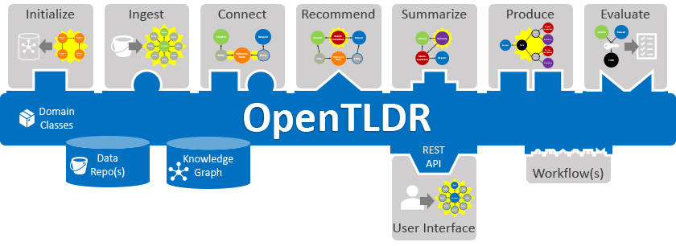
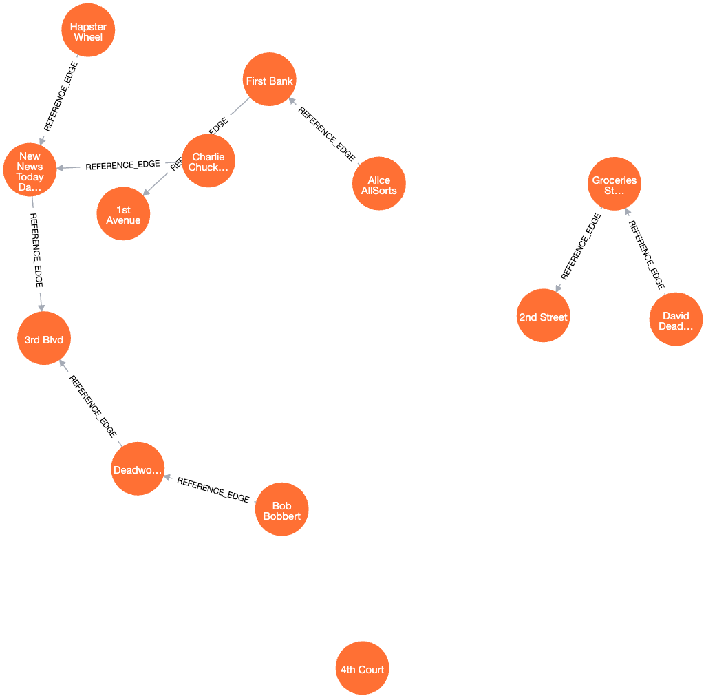
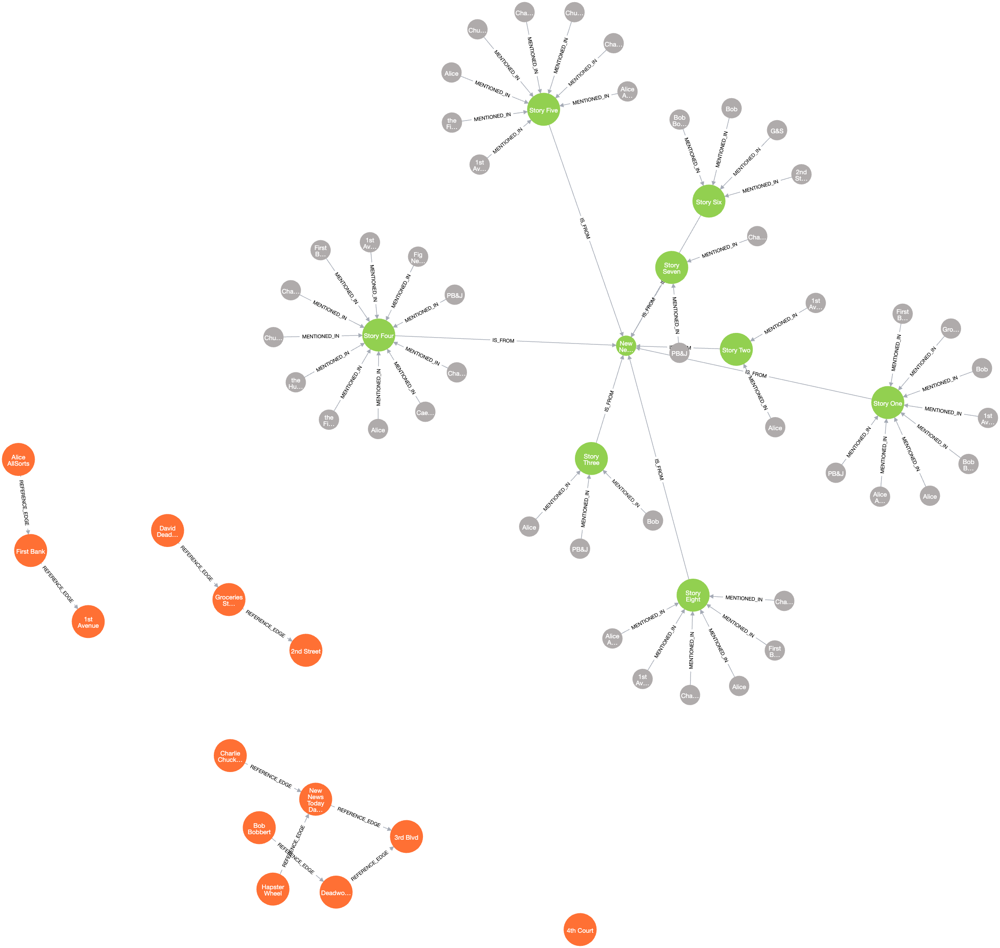
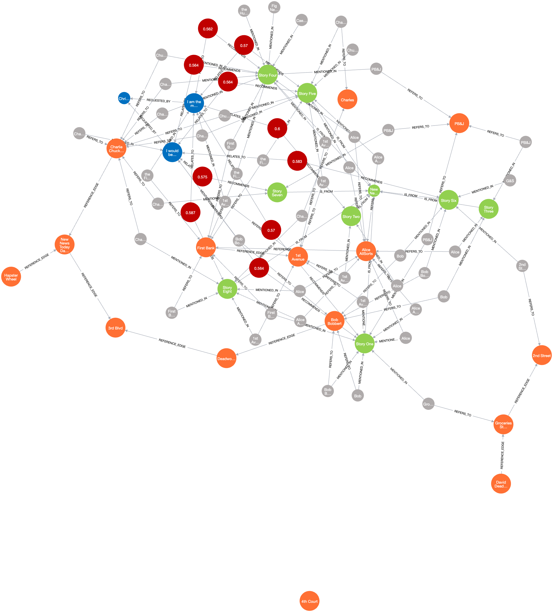
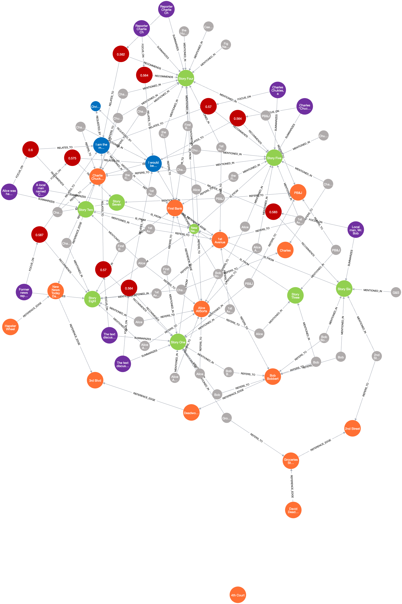
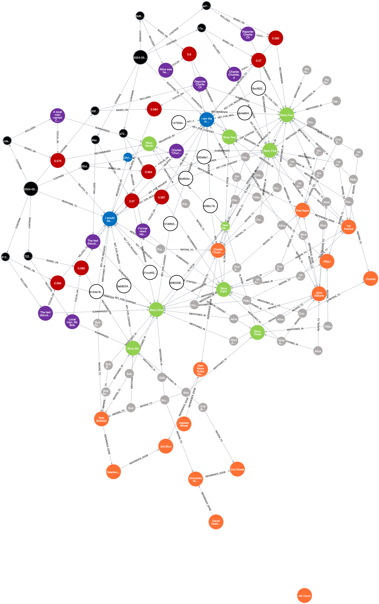

# OpenTLDR - Playground

This repository contains examples of OpenTDLR workflows and modules built with Python and in Jupyter Notebooks.
The intent is for you to clone this repository using the "Template" button in GitHub, so that you can work on your own edits to the Playground directly.

## Installation and Setup

Running OpenTLDR-based workflows requires some environmental setup, but simple defaults have been created to help quick start this setup.

The script **setup.sh** includes commands for doing most of this setup. You can execute this or simply review it for default setup steps.

The OpenTLDR Playground requires the following things be installed:

- A **neo4j server** that provides a graph database for storing data between steps of the workflow and runs. The Community Edition for neo4j works perfectly well, and we provide the docker-compose file `Neo4j/docker-compose.yml` that stand up a local server automatically. The default values for environment variables are setup to work with this installation, but you are welcome to change these to work with different installations.

- A **python virtual environment** that includes the required dependency packages. A `requirements.txt` file is provided to help with this setup. In Jupyter, you will likely need to set the Kernel for each notebook to the one running within this virtual environment in order to ensure that all the package dependencies are met.

- A **data set** for the workflow to ingest and use. A default set of simple text files is provided in the `sample_data` directory to quick start. OpenTLDR includes a ContentRepo class that you can retarget to a different set of files or an S3 bucket (or others TBD). The sample_data is intentionally small and focused, but contains many real-world data issues (e.g., names spelled wrong), so it provides a good test for ensuring that the workflow is working for testing changes quickly.

- A **GPT4ALL** LLM model is used in the Summarize step of the workflow, you will need to download this model from http://GPT4ALL.io and put it in the `./models/` directory. The default in the source code is `./models/mistral-7b-openorca.gguf2.Q4_0.gguf`.

## Where is the line between OpenTLDR and Workflows?

**OpenTLDR** is a Python Package that implements a framework, API, and set of data classes designed for implementing a workflow.

The **Workflow** implementation is a set of Python Notebooks that call into the framework but encapsulate their own analytic processes outside the framework.

In the image above, the OpenTLDR frame work is blue and the Workflow modules are the white blocks with the graph graphic. As show, these modules plug into interfaces in the framework to access services that they share. Under the framework are various utilities and capabilities that work independently of the automated workflow.

This combination provides researchers with three benefits:

1. **Quick Start** - You start with a working end-to-end prototype, and you can keep / reuse any of these components. For example, if you have your own summarizing technology, just change `Step_4_Summarize.ipynb` and you don't need to implement everything else to see it working.

2. **Modularity** - You are free to add / modify notebook(s) to implement you vision of how an end-to-end system should work. For example, changes to the `Workflow.ipynb` parameter `notebook_order` allow you to introduce new notebooks into the workflow.

3. **Evaluations** - You can compare your prototype to the baseline or other implementations easily. For example, what to know how much a TLDR report improves with your new NLP technology - you can now run the automated workflow before and after and compare scores.

4. **Convergence** - With multiple researchers and teams developing their own technologies in isolation, you tend to get silos. Providing a shared baseline gives everyone a common reference from which to diverge and to which to bring their solutions back so that others can evaluate and reuse them.

## Controlling your Workflow

The `Workflow.ipynb` notebook provides the structure that OpenTLDR workflows use to execute various notebooks in sequence. The default sequence is based on the Relevance(2023) workflow, which has been generalized and simplified a improve its reuse potential. This default workflow provides the analytic components for an working end-to-end TLDR prototype, and can serve as a baseline for exploring new and alternative analytic approaches for any (or even all) of the steps.

During development of new components, running the notebooks manually (and sometimes repeatedly) often saves time and supports debugging. However, the fully workflow should ALSO be designed to run without manual intervention. Executing the workflow runs the step in the order specified and produces read-only versions of the outputted notebooks.

> **Competition**: OpenTLDR runs a friendly competition to compare implementations to each other using a collection of hidden datasets. Participation is optional and requires you to submit your codebase, which will be executed in isolation using a headless execution of the Workflow notebooks as its starting place. The intent is to encourage incremental improvement in the end-to-end report quality while cultivating a set of components that can easily work together.

## Overview of Example (baseline) Workflow Steps

The Relevance(2023) baseline focuses on using a Knowledge Graph to inform how content (articles and requests) is tailored into a report. This includes how mentioned entities are interpreted, how articles are recommended to users, and how those articles are summerized. We understand that this implementation is NOT the only way to do any of these steps. It may not even be the best way - so you are encouraged researchers to replace these modules in the workflow and evaluate their results in comparison to this baseline and other implementations.

### Step_0_Initialize
This notebook clears the contents of the knowledge graph and loads any reference data. Reference Data can be imported as a Cypher file or two CSV files (one for nodes and one for edges).

### Step_1_Ingest
This notebooks reads in Content - a set of news-like articles (defaults to those in the "sample_data" folder but can be retargetted). In the next release this will also provide for S3 bucket data sources. The Relevance version uses Spacy to perform Named Entity Recognition (NER) on the Content and populates the knowledge graph with the sources, articles, and recognized entities. This is refered to as Active Data because it changes continuously.

### Step_1a_MockUI
This notbook simulates users requesting a TLDR based on their interests, in a production system this would be implemented with the User Interface. Like the Ingest step, this also uses NER on the text of the Request and build a similar structure as the Active Data but for the Information.
> **Reproducability Note:** In a live TLDR system, real user interactions through the User Interface would be used instead of a step like this. However, for prototypes this helps keeps the process consistent and automated. It is also a good example of how the workflow is automated for evaluation purposes where consistently and automation are essential for reproducable results.

### Step_2_Connect
This notbook scans the recognized entities from both the Active and Information Request Data, and the nodes from Reference Data. It uses a language embedding model to pair-wise compare each of the entities pulled from the text to each of the nodes of the same type in the Refernce Data. The most semantically similar entities are linked (with a confidence value) to the Reference nodes that they appear to "refer to". Any remaining entities are then compared to each other to determine if a "hypothesized" reference node should be created to link them together.

### Step_3_Recommend
by assessing the ontological distances (# of edges with confidence) between Content and Request (and scores on near neighbors) to score the "relevance" of each Content node to each Request node. Higher scoring relationships are used to create Recommendation nodes in the knowledge graph.

### Step_4_Summarize
This notebook uses an LLM (based on Gpt4all and langchain) to summarize the Content with a prompt that attempts to focus the summary on the most concepts of the Content that are most "relevant" to the Request and the Entities/Reference Data on the shortest path between the Content and the Request, the Summary is then integrated into the knowledge graph.

### Step_5_Produce
For each Request and each day, find the Recommendations and Summaries that need to get assembled into a TDRL structure (which is implemented as a TDLR node connected to TLDR Entries that identify the Recommendation and Summary to include).

### Step_6_Evaluate
This step loads the Evaluation Keys for the dataset and runs a set of evaluation metrics on the TLDRs that are produced by the workflow. This is intended to allow you to assess if your changes have helped or hurt the performance of the end-to-end process.

