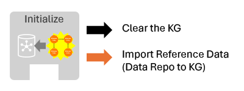

# Stage 1 Initialize
During the Initialize stage, we prepare the Knowledge Graph for the stages to come and pre-load any Reference Data availible.

## Notebook Capabilities

The first step is to clear the Knowledge Graph. There are two use-cases for this:
* To run a clean "batch" job, we will want to start with a completely empty KG. So, run *Clear_All*. If you do this, you will also need to reload any Reference Data you need. This is recommended for research and evaluation purposes because it avoids unintended effects from previous runs.
* To do a "live" update, we want to remove many of the old nodes each day, but NOT all of them. For example, we keep Reference Data, User Requests, Existing TLDRS, or Feedback. So, run *Clear_Live_Content* at the start of each daily update cycle.

For loading Reference Data, the choices are based on what type of data you have:
* *Load_Reference_Data* - Loads .cypher or .cql or .json files from a standard data_repo.
* *Load_CSV_Reference_Data* - Builds a Keyword and Concepts based Reference Data graph from two .csv files.
* *Example_Insert_Reference_Data* - Provides an example of programatically building a Reference Data graph.
* You can also skip loading Reference Data entirely, but this places a heavier emphasis on discovering Entities in Stage 3.

## Parameters

Variables that a Workflow can override in the notebooks.

| Variable | Description |
| ------ | ----------- |
| message | In *Clear_All* this is a test message that is simply printed by the notebook. The intend here is to demonstrate parameter passing as a learning example. |
| keyword_to_concept_csv_file concept_to_concept_csv_file | In *Load_Reference_Data_From_CSV*, these are the paths (relative to notebook itself) where the csv files to read in are located. |
| data_repo_config | In *Load_Reference_Data*, this is the specification for an OpenTLDR Data_Repo from which to ingest Reference Data. |
| logging_level | This can be used to control the amount of logging data that is outputted by OpenTLDR when running this notebook. The options (from least to most verbose) are ERROR, WARN, INFO, DEBUG. Note, these are enumerations and will show up as numbers in the parameter-injection cell. |
| verbose | A boolean value to indicate if the notebooks should print out more of the processing steps it is doing, by default these are set to True. |

## Expected Results

The results of this stage should be:
- A clear KG (or at least cleaned up to the extend needed)
- ReferenceNode nodes connected to each other with ReferenceEdge edges