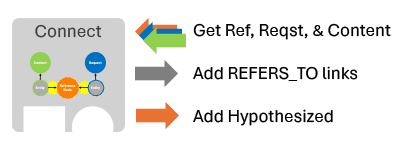

# Stage 3 Connect
During the Connect stage, we make connections in the Knowledge Graph between the Active Data (e.g., Content and Requests) and Reference Data. Going into the step (in a clean batch run) the KG will be multiple disconnected graphs, the intent of this stage is to link them together so that paths can be found.

## Notebook Capabilities

This notebook creates new "REFERS_TO" edges in the KG between previously identified Entities and Reference Data:
* An Entity node refers to an existing Reference Data node. For example a KEYWORD specified in Reference Data can be found in the text of a Content or Request node. Alternatively, an Entity might be semantically very similar to the same type of entity in Reference Data. 
* If very similar Entities exist, but there is no coorespondingly similar Reference Data, this step may "Hypothesize" such an object and create a new node and edges. These are marked with the attribute ReferenceNode.hypothsized=True. The intent here is to enable new information to be discovered over time and used without manually updating reference data.

## Expected Results

The results of this stage should be:
- New "REFERS_TO" edges between Entities and ReferenceNodes